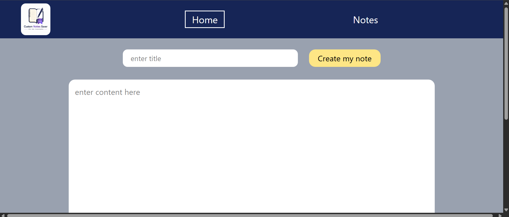
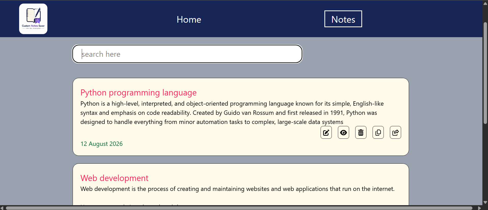
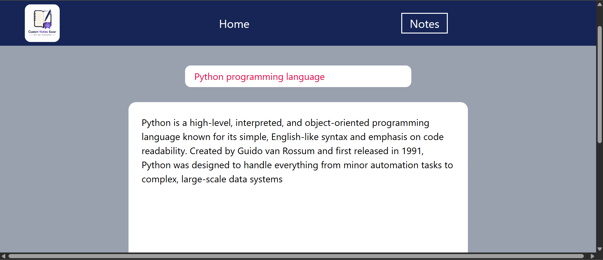
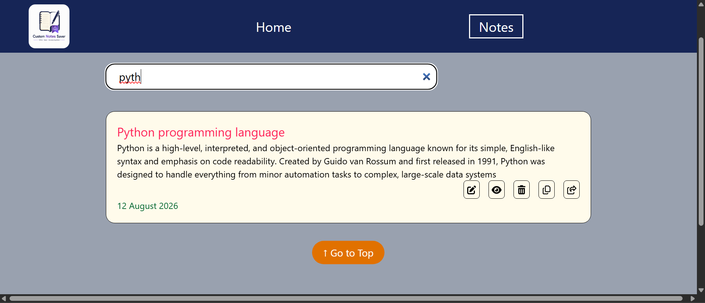
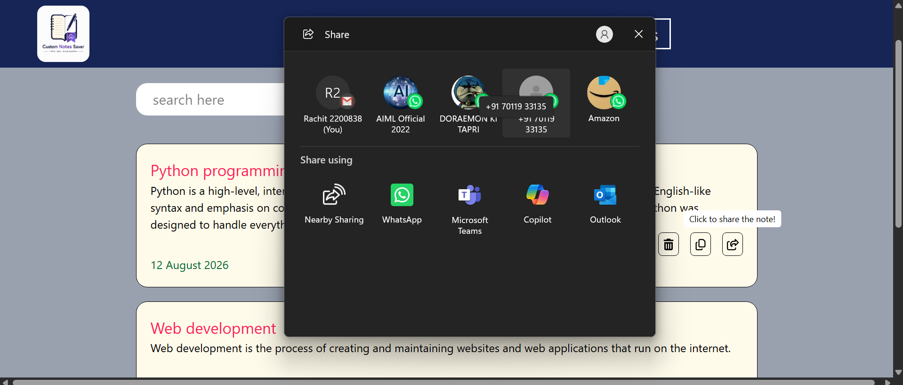
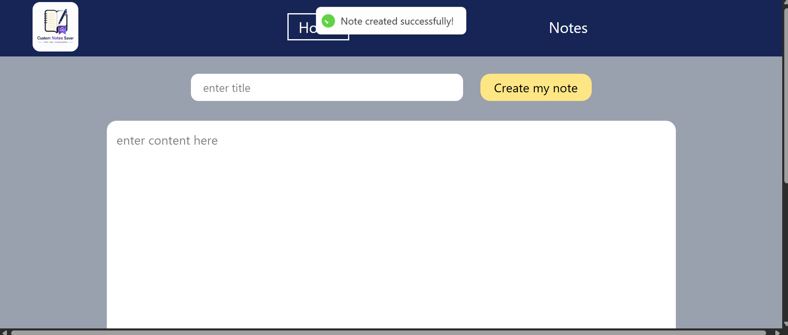

# 📝 Custom Notes Saver

A modern and user-friendly **Notes Management Web Application** built with **React.js** and **Vite**.

Custom Notes Saver allows users to create, manage, search, edit, view, copy, share, and delete their notes through a clean and responsive interface.

🔗 **Live Demo:** [Custom Notes Saver](custom-notes-saver-hqg3cg3k8-rachit-singh-rawat.vercel.app)

---

## 📌 About the Project

**Custom Notes Saver** is a frontend web application designed to provide a simple and convenient way to manage personal notes.

Users can create notes with a title and content, view their saved notes, search for specific notes, open individual notes, edit existing notes, delete unwanted notes, copy note content, and share notes.

The project was developed to gain practical experience with **React.js, Redux Toolkit, React Router, Tailwind CSS, component-based development, and frontend application deployment**.

---

## ✨ Features

### 📝 Create Notes

Create a new note by entering a title and detailed content.

### 📋 View All Notes

View all saved notes in an organized layout along with their creation dates.

### 🔎 Search Notes

Search through saved notes quickly using the search bar.

### 👁️ View Single Note

Open an individual note to view its complete title and content separately.

### ✏️ Edit Notes

Modify the title or content of an existing note whenever required.

### 🗑️ Delete Notes

Remove notes that are no longer required.

### 📋 Copy Notes

Copy note content easily for use elsewhere.

### 🔗 Share Notes

Share notes using the application's integrated sharing functionality.

### 📅 Date Display

Each note displays its creation date.

### 🔔 Notifications

Interactive toast notifications provide feedback when actions are successfully completed.

### 📱 Responsive Interface

The application is designed to provide a clean experience across different screen sizes.

### 🧭 Easy Navigation

Separate Home and Notes sections make it easy to navigate through the application.

---

## 🛠️ Technologies Used

### Frontend

* **React.js** – Building the user interface
* **JavaScript** – Application logic
* **HTML5** – Page structure
* **CSS3** – Styling
* **Tailwind CSS** – Utility-first styling

### Libraries & Tools

* **Vite** – Development server and build tool
* **React Router DOM** – Client-side routing
* **Redux Toolkit** – State management
* **React Redux** – Connecting Redux with React
* **React Hot Toast** – Toast notifications
* **React Share** – Sharing functionality
* **Font Awesome** – Icons
* **ESLint** – Code quality and linting
* **Git & GitHub** – Version control
* **Vercel** – Deployment

---

## 🖥️ Screenshots

### 🏠 Home / Create Note

The Home page provides a simple interface for creating a new note by entering a title and note content.



---

### 📋 Notes Page

The Notes page displays all saved notes along with their creation dates and available actions.



---

### 👁️ Single Note View

Users can open an individual note to view its complete title and content separately.



---

### 🔎 Search Notes

Users can search for specific notes using the search bar.



---

### 🔗 Share Note

The sharing feature allows users to share a note using the available sharing options on their device.



---

### 🔔 Note Creation Notification

A toast notification provides confirmation when a note has been created successfully.




---

## ⚙️ Getting Started

Follow the steps below to run the project locally.

### Prerequisites

Make sure you have the following installed:

* [Node.js](https://nodejs.org/)
* npm
* Git

### 1. Clone the Repository

```bash
git clone https://github.com/RachitRawat720/custom-notes-saver.git
```

### 2. Navigate to the Project

```bash
cd custom-notes-saver
```

### 3. Install Dependencies

```bash
npm install
```

### 4. Start the Development Server

```bash
npm run dev
```

Open the local URL displayed in your terminal to view the application.

---

## 🏗️ Build for Production

To create an optimized production build:

```bash
npm run build
```

To preview the production build locally:

```bash
npm run preview
```

---

## 🚀 Deployment

This project is deployed using Vercel.

### Production Build

To create an optimized production build:

```bash
npm run build

The live application is available at:

🔗 **[Custom Notes Saver](https://RachitRawat720.github.io/custom-notes-saver/)**

---

## 📂 Project Structure

```text
custom-notes-saver/
│
├── public/
│
├── screenshots/
│   ├── home.png
│   ├── notes.png
│   ├── single-note.png
│   ├── search.png
│   ├── share.png
│   └── create-note.png
│
├── src/
│   ├── assets/
│   ├── components/
│   ├── ...
│   ├── App.jsx
│   └── main.jsx
│
├── .gitignore
├── eslint.config.js
├── index.html
├── package.json
├── package-lock.json
├── vite.config.js
└── README.md
```

> The exact contents of the `src` directory may vary as the project evolves.

---

## 🧠 Key Concepts Implemented

This project implements and demonstrates several important frontend development concepts:

* Component-based architecture
* React functional components
* React hooks
* State management with Redux Toolkit
* Client-side routing
* Dynamic routing for individual notes
* Form handling
* Search and filtering
* CRUD-style note operations
* Event handling
* Reusable UI components
* Third-party library integration
* Responsive web design
* Toast notifications
* Note sharing functionality
* Application deployment

---

## 📚 What I Learned

While building Custom Notes Saver, I gained practical experience in:

* Developing applications using React.js
* Managing application state using Redux Toolkit
* Implementing navigation using React Router
* Working with dynamic routes
* Creating reusable React components
* Handling forms and user inputs
* Implementing search functionality
* Integrating external React libraries
* Creating responsive user interfaces
* Organizing a frontend project
* Implementing note management operations
* Adding sharing functionality
* Deploying a React application using Vercel
* Debugging and improving frontend applications

---

## 🔮 Future Improvements

The project can be extended with several additional features:

* 🔐 User authentication and authorization
* 💾 Backend and database integration
* ☁️ Cloud synchronization
* 🏷️ Categories and tags for notes
* 📌 Pin important notes
* 🌙 Dark mode
* 🔍 Advanced search and filtering
* 📊 Note statistics
* 📤 Export notes as PDF or text
* 🔄 Synchronization across multiple devices
* 🗂️ Sorting notes by title or date

---

## 🎯 Project Objective

The main objective of this project was to build a practical and functional notes management application while strengthening my knowledge of **modern frontend development using React.js**.

The project focuses on creating a clean user experience while implementing features such as **note creation, note management, searching, individual note viewing, editing, copying, sharing, state management, and navigation**.

---

## 👨‍💻 Author

### Rachit Rawat

**MERN Stack Developer**

* GitHub: [@RachitRawat720](https://github.com/RachitRawat720)
* Project Repository: [Custom Notes Saver](https://github.com/RachitRawat720/custom-notes-saver)
* Live Demo: [Custom Notes Saver](https://custom-notes-saver-hqg3cg3k8-rachit-singh-rawat.vercel.app)

---

## ⭐ Support

If you find this project useful or interesting, consider giving the repository a ⭐ on GitHub.

---

### 🚀 Built with React.js, Vite & Tailwind CSS

**Made by Rachit Rawat**
